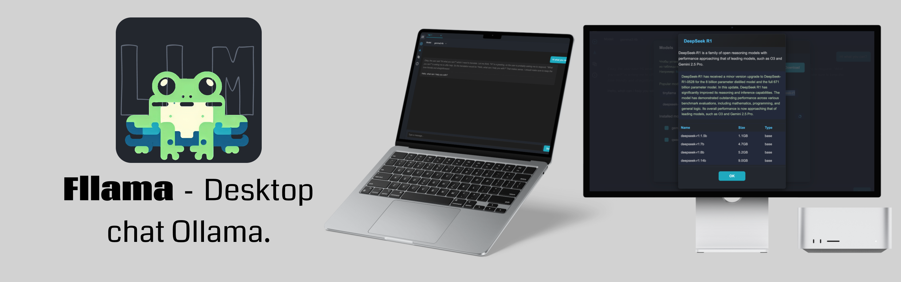
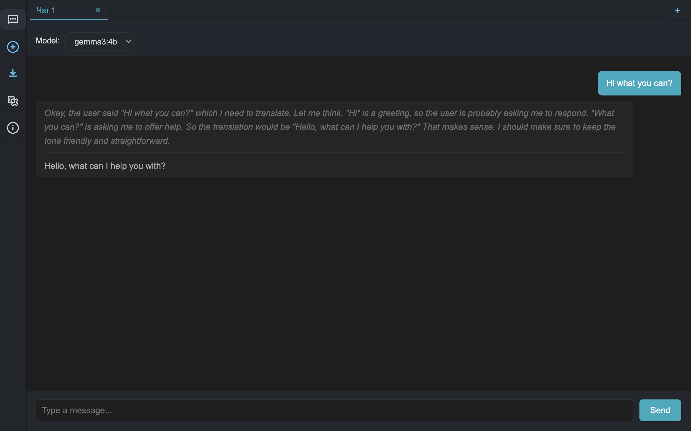

# Fllama
---
[README_EN](README) | [README_RU](READMERU)

**Fllama** — это кроссплатформенный десктопный чат-клиент на Electron для работы с Ollama.



## Возможности

- Современный интерфейс на Electron
- Поддержка Ollama
- Поддержка Windows, macOS (Intel и Apple Silicon), Linux
- Быстрая установка и запуск

## Технологии

- **Electron** — фреймворк для создания десктопных приложений.
- **Node.js** — для работы Electron и управления зависимостями.
- **HTML5** — разметка пользовательского интерфейса.
- **CSS3** — стилизация и адаптивный дизайн приложения.
- **JavaScript** — логика приложения, взаимодействие с Electron и Ollama API.
- **Ollama API** — взаимодействие с локальным сервером Ollama для работы с языковыми моделями.

## Скриншоты



## Требования

Для работы Fllama требуется установленный Ollama.

- **Windows**: скачайте установщик с [официального сайта Ollama](https://ollama.com/download/windows) и следуйте инструкциям.
- **macOS**: скачайте .dmg с [официального сайта Ollama](https://ollama.com/download/mac) и перенесите Ollama в папку Applications.
- **Linux**: выполните в терминале:
  ```sh
  curl -fsSL https://ollama.com/install.sh | sh
  ```

Проверьте установку командой:
```sh
ollama --version
```

## Установка

### Готовые сборки

Скачайте последнюю версию из [GitHub Releases](https://github.com/ollama/fllama/releases).

### Сборка из исходников

1. Клонируйте репозиторий:
   ```sh
   git clone https://github.com/arduradiokot/fllama.git
   cd fllama
   ```

2. Установите зависимости:
   ```sh
   npm install
   ```

3. Запустите приложение в режиме разработки:
   ```sh
   npm start
   ```

4. Для сборки под нужную платформу используйте:
   - **Windows x64:**  
     `npm run build:win-x64`
   - **macOS x64:**  
     `npm run build:mac-x64`
   - **macOS ARM64 (Apple Silicon):**  
     `npm run build:mac-arm64`
   - **Linux x64:**  
     `npm run build:linux-x64`

## Структура проекта

```
.
├── main.js         # Точка входа Electron
├── preload.js      # Preload-скрипт для Electron
├── renderer.js     # Логика рендерера (UI)
├── index.html      # Основной HTML интерфейс
├── style.css       # Стили приложения
├── build/          # Иконки для разных платформ
├── dist/           # Сборки для разных платформ
├── package.json    # Конфигурация проекта и сборки
└── .gitignore
``` 

## Лицензия

Проект распространяется под лицензией GNU GPL v2.0. См. файл [LICENSE](LICENSE).

## Contributing

Вклад приветствуется! Чтобы внести изменения:

1. Форкните репозиторий и создайте новую ветку для своей фичи или исправления.
2. Оформите коммиты с понятными сообщениями.
3. Откройте Pull Request с описанием изменений.
